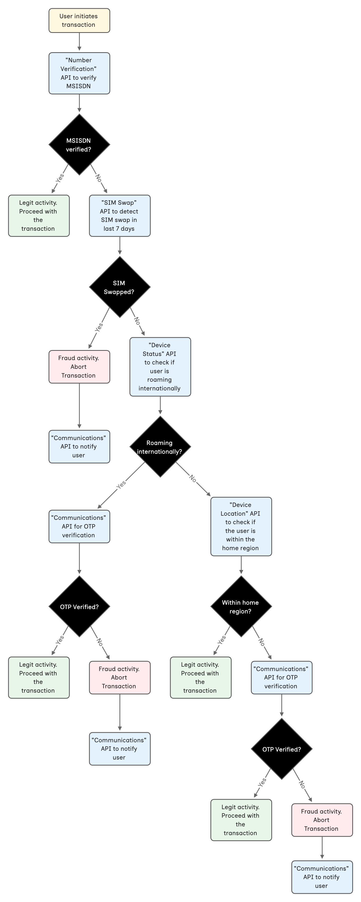

# Mobile Banking Fraud Prevention
A robust fraud detection system that uses real-time APIs to verify the user’s registered SIM, detect SIM swaps, check device roaming and location, and authenticate high-risk transactions with OTP verification, ensuring secure and seamless mobile banking operations.

### Tech Stack
- [NestJS](https://nestjs.com) for backend API.
- HTML, CSS and JS for responsive demo website.

### Prerequisites
- [NodeJS](https://nodejs.org/en/download/package-manager)

### How to setup
- Clone the project on your system.
- Execute the below steps.
```
cd vonage-holiday-hackathon-2024-mobile-banking-fraud-prevention
npm install
```
- Setup environment variables
```
cp .env.example .env
```
- Run the project
```
npm run start:dev
```
- The Swagger page is available at http://localhost:3000/api-docs
- The Demo website is available at http://localhost:3000

### Environment Variables
- `VONAGE_APPLICATION_JWT`: Generated from [here](https://developer.vonage.com/en/jwt).
- `VONAGE_MESSAGING_API_KEY`: Available on [Vonage API Dashboard](https://dashboard.nexmo.com).
- `VONAGE_MESSAGING_API_SECRET`: Available on [Vonage API Dashboard](https://dashboard.nexmo.com).
- `OTP_WHITELISTED_MSISDN`: Mobile number registered [here](https://dashboard.nexmo.com/messages/sandbox).

### Demo users
The demo works for two users. The `userId` is passed in the query string of the homepage.
```
http://localhost:3000/?user-id=67460869dc840fad5b062a60
```
Below are the users.
- `67460869dc840fad5b062a60`: Positive scenario. The number verification passes.
- `67460bb3dc840fad5b062a61`: Negative scenario. The number verification fails. The other checks come into play


### Project Workflow
